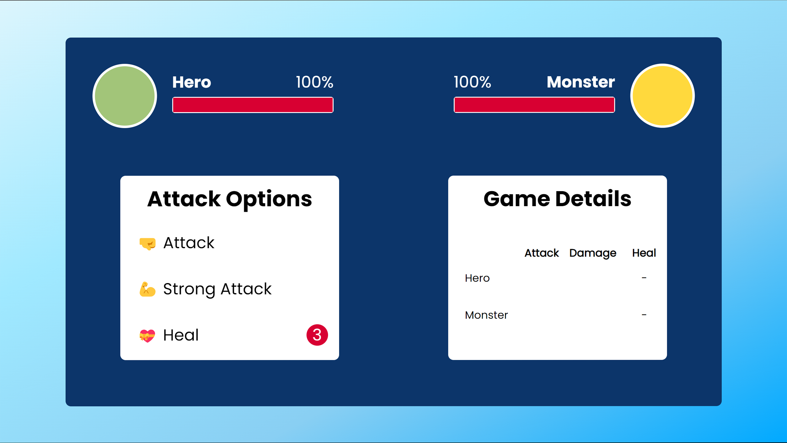

<h1 align="center">OTP Verification</h1>

<h3>About This Project :</h3>

In this project, I tried to create a game using HTML5, CSS3, SASS(SCSS), JavaScript, which hope will be useful for you and you'll like it

<h3>How to setup :</h3>

Clone this project on your own pc 
<pre>git clone https://github.com/alireza-moradi7/games.git</pre>
</pre>

Go to folder Monster Killer and open index.html file

<b>If you like it, happy me with a ⭐</b>

<h3>Links</h3>
<a href="https://alireza-moradi7.github.io/games/Monster Killer">View Project Online</a>
  
<a href="https://youtu.be/C_rfDI4H3nA?si=NfinWbG-VtK0SrzJ">Watch Full Video</a>

<h3>Authors</h3>

Frontend Developer : 
<b>Alireza Moradi</b>

